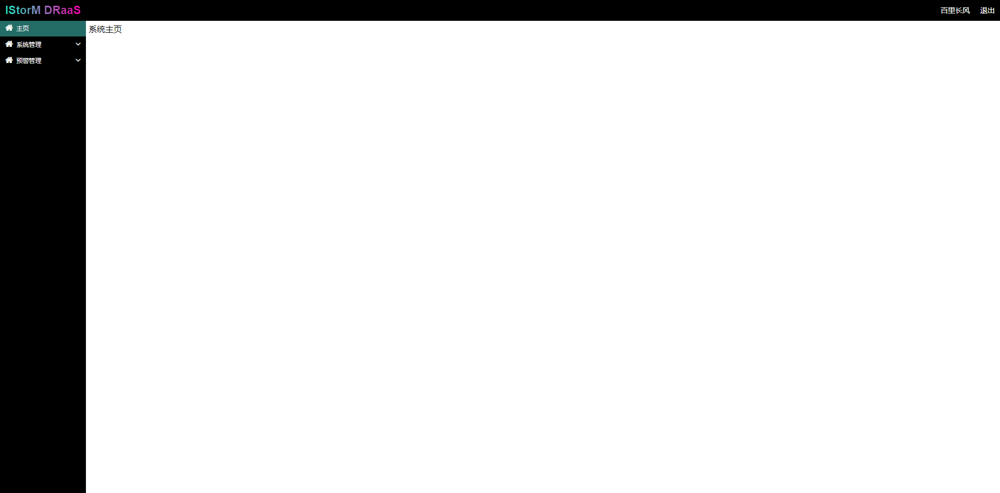

# xincan-nest-client

> 基于vue、elementui等前端技术构建前端展示界面，用于学习和参考

## 系统构建

``` bash
安装系统所需要的依赖
npm install

服务启动默认访问地址 localhost:8080
npm run dev

构建系统
npm run build

为生产构建并查看Bundle Analyzer报告
npm run build --report
```

## 表格封装展示
  
